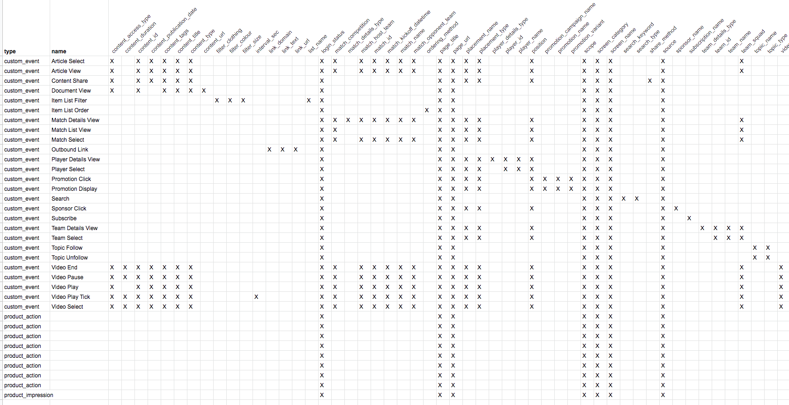

# h37-mparticle-data-plan

## Introduction

This python script helps mParticle users visualizing their events-attributes mapping in order to:
1. Validate their data plan is correct and consistent
2. Easily get an idea of which properties are attached to the events 

It uses the mParticle Data Plan API to download a specific version of a data plan, then builds a matrix that is saved as a CSV file. This file can then be uploaded in Google Sheets.



## Getting started

### Authentication
You need to get a Client ID and a Client secret for your mParticle workspace. Instructions can be found in the official docs:
[https://docs.mparticle.com/developers/credential-management#creating-new-credentials](https://docs.mparticle.com/developers/credential-management#creating-new-credentials)

Additionally, gather your Workspace ID, your Plan ID and your Plan version and insert the respective values in ``CONFIG`` in ``main.py``

```python
CONFIG = {
	"client_id": "{{YOUR_CLIENT_ID}}",
	"client_secret": "{{YOUR_CLIENT_SECRET}}",
	"workspace_id": "{{YOUR_WORKSPACE_ID}}",     # INT
	"plan_id": "{{YOUR_PLAN_ID}}",               # STRING
	"plan_version": "{{YOUR_PLA_VERSION}}"       # INT
}
```
### Install dependencies

**Go to folder:** ``cd h37-mparticle-data-plan``

**Install dependencies:** ``pip install -r requirements.txt``

## Run the script
```python main.py```

This will save the CSV file by default under ``matrix.csv``

## Visualize

To visualize the matrix, you can import the CSV file in a new Google Sheets.


##  To do:
- Errors handling and verbose
- Make package
- Support nested attributes/objects
- Support Google Sheets
- Support Data Plans uploads